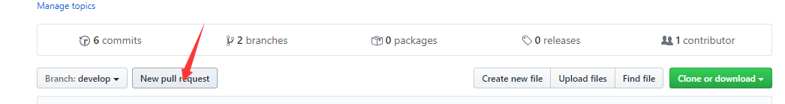
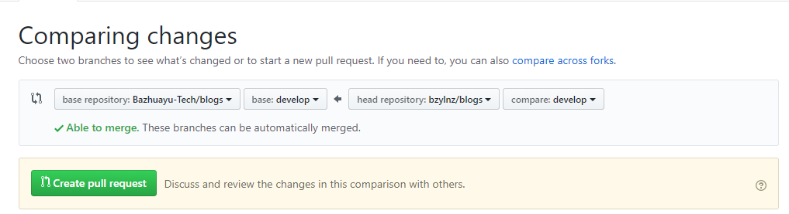
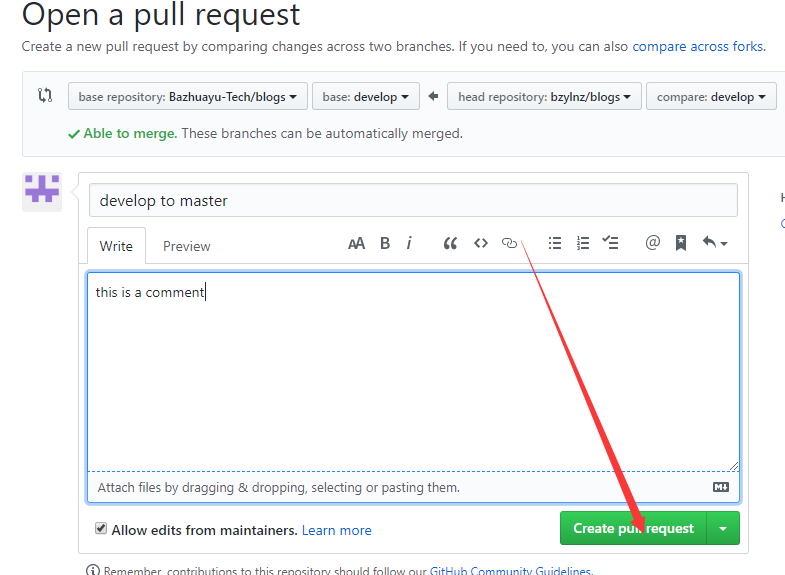

# blogs
视界信息八爪鱼团队博客分享
## 内容列表

- [背景](#背景)
- [项目说明](#项目说明)
- [如何贡献](#如何贡献)
- [PR流程](#PR流程)
- [使用许可](#使用许可)
## 背景
## 项目说明
* 本博客分为`blogs`、`images`目录，其中blogs存放博客正文，以`Markdown`格式，images存放正文图片
* 博客文件命名规范：序号-主题-作者-日期.md
* 图片存储规范：每篇博客正文如含有图片，均先在`images`下创建对应博客序号目录上传图片后，在正文中引用
## 如何贡献
根据项目说明，提[一个Issue](https://github.com/Bazhuayu-Tech/blogs/issues/new)或者提交一个Pull Request
## PR流程
- `fork`到自己的仓库
- `git clone` 到本地
- 根据[项目说明](#项目说明)完成博客创作并提交，推送到远程
- 去自己github仓库对应fork的项目下create new pull request
1. 进入到fork的仓库内部，点击`New pull request`按钮

    
2. 进入Comparing changes页面，在右边选择仓库和分支，确认各项更改正确后，看到`Able to merge`，点击`Create pull request`按钮。

    
3. 填写相关信息，点击`Create pull request`按钮即可

    

## 使用许可
